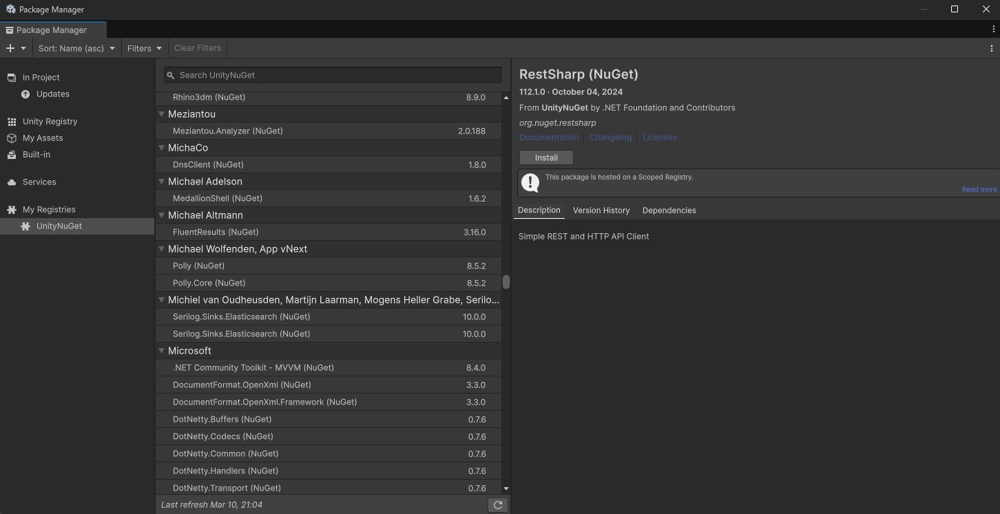

# UnityNuGet [](https://github.com/xoofx/UnityNuGet/actions) [](https://unitynuget-registry.openupm.com/status) [](https://unitynuget-registry.openupm.com/-/all) [](https://www.nuget.org/packages/UnityNuGet.Tool)


This project provides a seamlessly integration of a [curated list](registry.json) of NuGet packages within the Unity Package Manager.

> [!IMPORTANT]
> DISCLAIMER: This is not an official service provided by Unity Technologies Inc.

## Usage

> [!NOTE]
> Feed provided by [OpenUPM](https://medium.com/openupm/openupm-launches-alternative-unitynuget-registry-0b8cc663cc41).

### Add scope registry (manifest.json)

In order to use this service you simply need to edit the `Packages/manifest.json` in your project and add the following [scoped registry](https://docs.unity3d.com/Manual/upm-scoped.html):

```json
{
  "scopedRegistries": [
    {
      "name": "Unity NuGet",
      "url": "https://unitynuget-registry.openupm.com",
      "scopes": [
        "org.nuget"
      ]
    }
  ],
  "dependencies": {
    "org.nuget.scriban": "2.1.0"
  }
}
```

### Add scope registry (Package Manager UI)

Instructions: <https://docs.unity3d.com/Manual/class-PackageManager.html>

```yaml
Name: Unity NuGet

Url: https://unitynuget-registry.openupm.com

Scope(s): org.nuget
```

### Disable Assembly Version Validation

> [!IMPORTANT]
In Unity 2022.2+, this is the [default behavior](https://discussions.unity.com/t/editor-assembly-loading-issues-unloading-broken-assembly-could-not-load-signature/760376/46), so no action is required.

This step is necessary to ensure that binding redirects for [strongly named assemblies](https://learn.microsoft.com/en-us/dotnet/standard/assembly/strong-named) in NuGet packages resolve correctly to paths _within the Unity project_.

For earlier Unity versions, uncheck `Project Settings > Player > Other Settings > Configuration > Assembly Version Validation`.

### Verify scoped registry installation

> [!WARNING]
> WARNING: If you are encountering weird compilation errors with UnityNuGet and you have been using UnityNuGet already,
> it could be that we have updated packages on the server, and in that case, you need to clear the cache containing
> all Unity NPM packages downloaded from the registry.
> On Windows, this cache by default is located at: `%LOCALAPPDATA%\Unity\cache\npm`
>
> Cache locations by OS: <https://docs.unity3d.com/Manual/upm-cache.html>

When opening the Package Manager Window, you should see a few packages coming from NuGet (with the postfix text `‎ (NuGet)`)



## Adding a package to the registry

This service provides only a [curated list](registry.json) of NuGet packages.

Your NuGet package needs to respect a few constraints in order to be listed in the curated list:

- It must have non-preview versions (e.g `1.0.0` but not `1.0.0-preview.1`).
- It must provide at least `.NETStandard2.0` (and optionally `.NETStandard2.1`) assemblies as part of its package.

You can send a PR to this repository to modify the [registry.json](registry.json) file (don't forget to maintain the alphabetical order and format).

You also need to **specify the lowest version of your package that has support for `.NETStandard2.0`** upward so that other packages depending on your package have a chance to work with.

Beware that **all transitive dependencies of the package** must be **explicitly listed** in the registry as well.

> [!NOTE]
>
> - We reserve the right to decline a package to be available through this service.
> - The server will be updated only when a new version tag is pushed on the main branch.

## Compatibility

Only compatible with **`Unity 2019.1`** and potentially with newer version.

> [!NOTE]
> This service is currently tested with **`Unity 2019.x, 2020.x, 2021.x, 2022.x, 2023.x and 6000.0.x`**.
>
> It may not work with a more recent version of Unity.

## Self-Hosted installation

To have more control of the server, it is recommended to host the service on your own. This way you can decide which specific packages to include in the [registry.json](registry.json) file which makes the server lighter.

This project publishes a [Docker image in ghcr.io](https://github.com/bdovaz/UnityNuGet/pkgs/container/unitynuget) that can be consumed to create a container and host it as you wish:

- [Local](examples/docker)
- [Azure Container Apps](https://azure.microsoft.com/en-us/products/container-apps)
- [AWS Fargate](https://aws.amazon.com/fargate/)
- [Google Cloud Run](https://cloud.google.com/run)

There is a complete example with all available options in [examples/docker](examples/docker).

### Accessing a private NuGet feed from Azure DevOps

> [!NOTE]
> The [Azure DevOps PAT](https://learn.microsoft.com/en-us/azure/devops/organizations/accounts/use-personal-access-tokens-to-authenticate) must have `Packaging (Read)` permissions.

As documented in the example, it is possible to provide a custom NuGet.Config file.

To add a private feed, the following fields must be filled in:

```xml
<?xml version="1.0" encoding="utf-8"?>
<configuration>
  <packageSources>
    <clear />
    <add key="nuget.org" value="https://api.nuget.org/v3/index.json" protocolVersion="3" />
    <add key="MyCustomFeed" value="https://pkgs.dev.azure.com/<ORG_NAME>/<PROJECT_NAME>/_packaging/<FEED_NAME>/nuget/v3/index.json" />
  </packageSources>
  <packageSourceCredentials>
    <MyCustomFeed>
      <add key="Username" value="<Azure DevOps Email>" />
      <add key="ClearTextPassword" value="<Azure DevOps PAT>" />
    </MyCustomFeed>
  </packageSourceCredentials>
</configuration>
```

## dotnet tool installation

UnityNuGet is also distributed as a dotnet tool. The difference is that in this case it does not act as a server but as a process that processes all the packages in `registry.json` in one pass.

This use case is useful when you simply don't want to depend on an external server and want your dependencies to be [local packages](https://docs.unity3d.com/6000.1/Documentation/Manual/upm-localpath.html).

To use it, once installed with `dotnet install -g UnityNuGet.Tool` simply run the command `unityNuGet`.

> Note that an `appsettings.json` file must exist in the working directory from which the command is executed.

## FAQ

### **Where is hosted this service?**

It is hosted by [OpenUPM](https://medium.com/openupm/openupm-launches-alternative-unitynuget-registry-0b8cc663cc41).

### **Why can't you add all NuGet packages?**

The reason is that many NuGet packages are not compatible with Unity, or do not provide `.NETStandard2.0` or `.NETStandard2.1` assemblies or are not relevant for being used within Unity.

### **Why does it require .NETStandard2.0?**

Since 2019.1.x, Unity is compatible with `.NETStandard2.0` and it is the .NET profile that is preferred to be used.

Having a `.NETStandard2.0` for NuGet packages for Unity can ensure that the experience to add a package to your project is consistent and well supported.

As of Unity 2021.x it also supports `.NETStandard2.1` so packages providing this target will be compatible with this version of Unity or newer.

> More information: <https://docs.unity3d.com/Manual/dotnet-profile-support.html>

### **How this service is working?**

This project implements a simplified compatible NPM server in C# using ASP.NET Core and converts NuGet packages to Unity packages before serving them.

At a threshold defined by `UpdateInterval` (10 minutes by default), packages are updated from NuGet so that if a new version is published, from the curated list of NuGet packages, it will be available through this service.

Once converted, these packages are cached on the disk on the server.

## License

This software is released under the [BSD-Clause 2 license](https://opensource.org/licenses/BSD-2-Clause).

## Author

Alexandre Mutel aka [xoofx](https://xoofx.github.io)

## Maintainer/s

Borja Domínguez aka [bdovaz](https://github.com/bdovaz)
